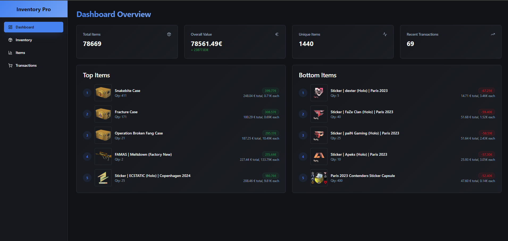

# 🎯 CS2 Portfolio

Easily track and manage your **CS2 investments** — powered by Docker, RabbitMQ, and .NET 9.


---

## 📚 Table of Contents

* [⚙️ Installation](#️-installation)
* [🚀 Getting Started](#-getting-started)
* [🧩 Services Overview](#-services-overview)
* [🧱 Minimal Setup](#-minimal-setup)
* [🛠️ Development Stack](#️-development-stack)
* [🐞 Issues](#-issues)
* [📝 License](#-license)

---

## ⚙️ Installation

1. **Clone the repository**

   ```bash
   git clone https://github.com/Schleifinho/cs2-portfolio-v2.git
   ```

2. **Navigate to the project directory**

   ```bash
   cd CSPortfolioV2
   ```

3. **Build the Docker images**

   ```bash
   docker compose build
   ```

4. **Start all containers**

   ```bash
   docker compose up -d
   ```

---

## 🚀 Getting Started

On first run, load the initial CS2 item data into the database:

```bash
psql -h localhost -p 5432 -U csapi -d csportfolio -f Data/DBDumps/items.sql
```

> **Note:**
> The dump file (`Data/DBDumps/items.sql`) is partial — CS2 continuously adds new items,
> and fetching the entire market at once is impractical.

Each container can be configured through either `appsettings.json` or `compose.yaml`.

---

## 🧩 Services Overview

### 🧠 csportfolioapi

* Core backend API service
* Runs on port **4000**
* Swagger UI: [http://localhost:4000/swagger/index.html](http://localhost:4000/swagger/index.html)

### 💻 csportfolio-web-app

* React + TypeScript frontend
* Runs on: [http://localhost:4040/](http://localhost:4040/)

### 🐇 rabbitmq

* Message broker used by MassTransit
* Management UI: [http://localhost:15672](http://localhost:15672)
  **Username:** `guest` **Password:** `guest`

### 🐘 cs-db (Timescale/Postgres)

* TimescaleDB (Postgres 16) container for application data
* Container name: `csportfolio-db`
* Connection details (default in `docker-compose`):

   * **Host:** `localhost`
   * **Port:** `5432`
   * **Database:** `csportfolio`
   * **User:** `csapi`
   * **Password:** `secretpass`
* Database data persisted via Docker volume `db_data` mounted to `/var/lib/postgresql/data`

### 💰 cspriceupdater

* Consumes `PriceUpdate` events and updates inventory prices hourly when
  the environment variable `ENABLE_PRICE_REFRESH=true` is set

### 📦 csitemimporter

* Imports CS2 item data into the database
* Item generation tools: *TBD*

---

## 🧱 Minimal Setup

To run the core system, start these containers:

* `cs-db` (Timescale/Postgres)
* `csportfolioapi`
* `masstransit-db`
* `rabbitmq`
* `redis`

These provide the API, messaging, and database layers required for minimal operation.

---

## 🛠️ Development Stack

| Component                       | Description                                      |
| ------------------------------- | ------------------------------------------------ |
| 🐳 **Docker**                   | Containerized development and deployment         |
| 🐘 **TimescaleDB / PostgreSQL** | Time-series and relational data storage          |
| 🐇 **RabbitMQ + MassTransit**   | Event-driven messaging and background processing |
| 💻 **.NET 9 (C#)**              | Backend and worker services                      |
| 🧩 **Entity Framework Core**    | ORM for PostgreSQL                               |
| ⚛️ **React + TypeScript**       | Modern frontend stack                            |

---

## 🐞 Issues

If you find bugs or want to request features, please open an issue on GitHub:
👉 [Create an issue](https://github.com/Schleifinho/cs2-portfolio-v2/issues)

---

## 📝 License

MIT © 2025 — [Schleifinho](https://github.com/Schleifinho)
